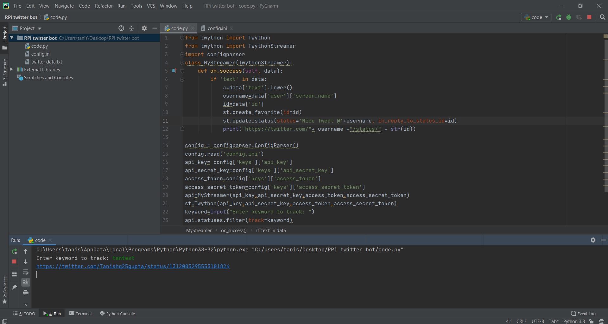

# TWITTER BOT

This is a twitter bot, it will like and retweet your tweet, containing some keyword and will print the url of tweet.
You can also use it to control GPIO pins of Raspberry Pi([as I did](https://youtu.be/962BUCFqvDA)) and twitter controlled home lights.
<br>
Here I used the twython library to use Twitter API, this library can be used to all the things mentioned in twitter API document. 

## Code
To use with Raspberry Pi and control GPIO use [rpicode.py](rpicode.py) and to use directly on desktop(no GPIO) use [code.py](code.py)

## Prerequisites

To install twython
```pip install twython```
or check [here](https://twython.readthedocs.io/en/latest/usage/install.html)
<br>
Generate your unique Twitter keys and token from [here](https://developer.twitter.com/en), create a [new app](https://developer.twitter.com/en/apps) and generate your own keys and token.

## How to run the script
Update the keys and tokens in code.
<br>
Run the python file and enter the keyword you want to track, now any new tweet will automatically liked and retweeted.
It will print the link of tweet<br>

## Video showing it controlling lights using Raspberry Pi
https://youtu.be/962BUCFqvDA

## Screenshot showing the direct use of the script


